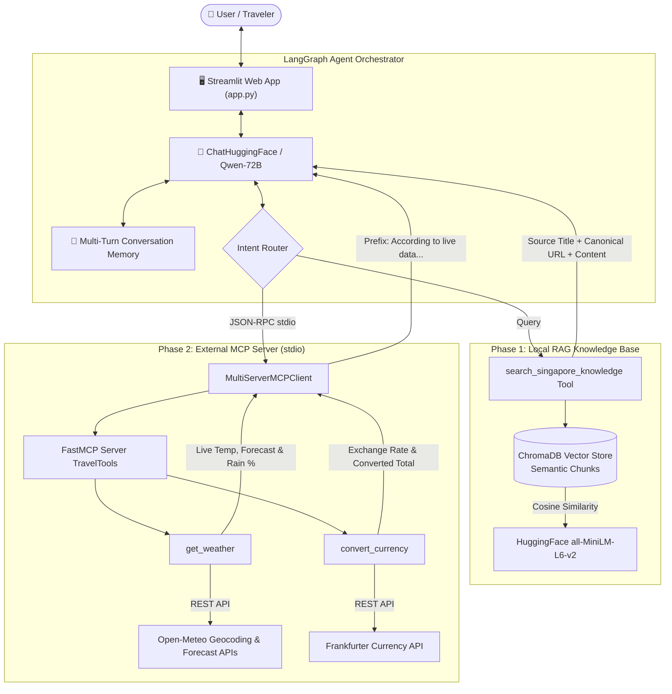

# AI Travel Planning Assistant

An intelligent multi-phase travel assistant codebase supporting local destination knowledge retrieval (RAG), real-time external API tool integration via Model Context Protocol (MCP), and interactive web UI orchestration powered by LangChain and LangGraph.

---

## 📁 Directory Structure

```text
Ai-travel-planning-assistant/
├── data/
│   ├── itineraries/             # 12 dedicated Visit Singapore sample itineraries
│   ├── neighbourhoods/          # 11 dedicated Visit Singapore featured neighbourhood guides
│   ├── singapore_essential_travel_information.md  # Weather, visas, transit, laws, taxes
│   ├── singapore_festivals_roots.md               # Roots.gov.sg (NHB) cultural festivals
│   ├── singapore_itineraries_master.md            # Comprehensive itineraries index
│   ├── singapore_neighbourhoods_master.md         # Comprehensive neighbourhoods index
│   └── singapore_wikivoyage.md                    # In-depth travel guide from Wikivoyage
├── src/
│   ├── __init__.py               # Package marker
│   ├── ingest_data.py            # Loads, tags metadata, chunks & persists to ChromaDB
│   ├── retriever_tool.py         # Exposes LangChain retriever tool (search_singapore_knowledge)
│   └── mcp_server.py             # Wrapper import for MCP tools server
├── mcp_server.py                 # FastMCP tools server over stdio transport
├── app.py                        # Streamlit UI & LangGraph Agent orchestrator
├── chroma_db/                    # ChromaDB vector database directory
├── requirements.txt              # Complete project dependencies
├── .env                          # Environment variable (HF token & model config)
└── README.md                     # Documentation & execution guide
```

---

## 🛠️ Environment Setup & Installation

### 1. Create a Python Virtual Environment (`venv`)

**On Windows (PowerShell / Command Prompt):**
```powershell
python -m venv venv
.\venv\Scripts\activate
```

**On macOS / Linux:**
```bash
python3 -m venv venv
source venv/bin/activate
```

### 2. Install Dependencies

```bash
pip install --upgrade pip
pip install -r requirements.txt
```

### 3. Configure Environment Variables (`.env`)

API keys and model configuration are managed securely through a local `.env` variable file.

Edit `.env` and fill in your Hugging Face API token:
```env
# Hugging Face User Access Token (from https://huggingface.co/settings/tokens)
# Permission required: "Make calls to Inference Providers"
HUGGINGFACEHUB_API_TOKEN=hf_your_token_here

# Hugging Face Model Identifier (defaults to Qwen/Qwen2.5-72B-Instruct)
HF_MODEL_NAME=Qwen/Qwen2.5-72B-Instruct
```
---

## 🚀 Execution Guide

### Destination Knowledge Assistant (RAG Pipeline)

#### Step 1: Ingest Data into ChromaDB
Recursively scans `data/` for all Markdown travel documents, extracts metadata (`source_title`, `url`), chunks content using `RecursiveCharacterTextSplitter` (prioritizing markdown section headers, chunk size 700, overlap 100), purges any previous index, generates local vector embeddings (`all-MiniLM-L6-v2`), and persists the fresh vector database to `./chroma_db`.

```bash
python src/ingest_data.py
```

#### Step 2: Retriever Tool
Loads persisted ChromaDB vectors and wraps the retriever using `create_retriever_tool` into the `search_singapore_knowledge` tool for the LLM agent.

```bash
python src/retriever_tool.py
```

---

### External API MCP Server (Model Context Protocol)

#### Run Standalone MCP Server over `stdio`
Launches the standalone Model Context Protocol server exposing real-time external APIs over standard I/O for integration with MCP-compatible clients or LangChain orchestrators.

```bash
python mcp_server.py
```

**Exposed MCP Tools:**
1. `convert_currency(amount: float, from_curr: str, to_curr: str) -> str` (Frankfurter API)
2. `get_weather(location: str, date: Optional[str] = None, end_date: Optional[str] = None) -> str` (Open-Meteo Geocoding & Forecast APIs)

---

### Interactive Streamlit Web Application (`app.py`)

Run the full interactive web application integrating Phase 1 RAG and Phase 2 MCP tools using LangGraph's agent orchestrator:

```bash
streamlit run app.py
```

> [!TIP]
> **Clean Full-Width Interface & Variable File Configuration**: The Streamlit interface runs in a clean, full-width chat layout with no sidebar panels or manual input widgets. It automatically loads your credentials (`HUGGINGFACEHUB_API_TOKEN`) and model identifier (`HF_MODEL_NAME`) securely from your local `.env` file upon startup.


## 🏛️ System Architecture



---

## 📚 Destination Knowledge Base Sources

The knowledge base is built from **3 public, authoritative travel resources** across **28 structured Markdown documents** (771 semantic chunks):

1. **Wikivoyage Singapore Travel Guide** (`data/singapore_wikivoyage.md`):
   - Exhaustive coverage of Singapore's history, culture, all major districts (Marina Bay, Sentosa, Civic District, Chinatown, Little India, Katong/Joo Chiat, Mandai, etc.), local customs, transit, safety, and dining.
   - Canonical URL: `https://en.wikivoyage.org/wiki/Singapore`
2. **National Heritage Board (NHB) Roots.gov.sg** (`data/singapore_festivals_roots.md`):
   - In-depth documentation of cultural, religious, and ethnic festivals (Chinese New Year, Thaipusam, Hari Raya Puasa, Deepavali, Mid-Autumn Festival, Vesak Day).
   - Canonical URL: `https://www.roots.gov.sg/stories-landing/stories/festivals-in-singapore/festivals-in-singapore`
3. **Official Visit Singapore (Singapore Tourism Board)**:
   - **Essential Travel Information** (`data/singapore_essential_travel_information.md`): Practical visitor guidance on weather, visa policies, MRT/transit, Singapore Tourist Pass, local etiquette/laws/fines, tipping, and GST tax refunds.
   - **Curated Sample Itineraries** (`data/singapore_itineraries_master.md` + 12 files in `data/itineraries/`): Day-by-day itineraries for 24 Hours, 2-Day City Explorer, 4 Days, 7 Days, Foodie, Family Getaway, Outdoor Adventure, Shopping, Honeymoon, Wellness, Girls Trip, and Solo Travel.
   - **Featured Neighbourhoods** (`data/singapore_neighbourhoods_master.md` + 11 files in `data/neighbourhoods/`): Detailed precinct profiles for Civic District, Chinatown, Kampong Gelam, Katong-Joo Chiat, Little India, Mandai, Marina Bay, Orchard Road, Sentosa, Singapore River, and Dempsey Hill.

---

## 🔄 RAG Ingestion & Retrieval Pipeline

1. **Metadata Tagging**: Each file defines explicit `Source Title` and canonical `URL` metadata in header tags.
2. **Semantic Header-Aware Chunking**: `src/ingest_data.py` splits documents using `RecursiveCharacterTextSplitter` prioritizing Markdown header boundaries (`\n## `, `\n### `, `\n#### `, `\n\n`), keeping attraction stops, day plans, and cultural advice intact.
   - Target Chunk Size: `700` characters
   - Chunk Overlap: `100` characters
3. **Clean Vector Generation**: Any existing vector database directory is purged and recreated from scratch (`recreate_from_scratch=True`) to eliminate stale data.
4. **Verifiable Source Attribution**: `src/retriever_tool.py` wraps the Chroma retriever using `create_retriever_tool` with a custom `document_prompt`:
   ```python
   document_prompt = PromptTemplate.from_template(
       "Source Title: {source_title}\nSource URL: {url}\nContent:\n{page_content}"
   )
   ```
   This guarantees that both the source title and canonical URL are delivered to the LLM context.

---

## ⚡ External MCP Tools Server (`mcp_server.py`)

Built with `FastMCP` running over standard input/output (`stdio`) transport:
- **`get_weather(location: str, date: Optional[str] = None, end_date: Optional[str] = None) -> str`**:
  - Dynamically resolves latitude and longitude using Open-Meteo Geocoding.
  - Supports querying specific dates (e.g., `'2026-09-22'`, `'tomorrow'`) or multi-day trip ranges (e.g., `'2026-09-21 to 2026-09-25'`).
  - When no date is provided, queries Open-Meteo Forecast for real-time current conditions (temperature, apparent feels-like, humidity, precipitation) and a 3-day daily forecast (high/low temperatures, precipitation probability percentage, and human-readable WMO condition descriptions).
- **`convert_currency(amount: float, from_curr: str, to_curr: str) -> str`**:
  - Normalizes colloquial currency names and symbols (`INR`, `rupees`, `SGD`, `dollars`, `USD`, `EUR`, `GBP`, `¥`, etc.) into 3-letter ISO codes.
  - Fetches live rates from Frankfurter API (`follow_redirects=True`).
  - Returns the exact exchange rate, conversion date, and converted total.

---

## 🧠 Prompt Engineering & Context Strategy

The system prompt in `app.py` enforces strict behavioral directives:
1. **Destination Facts from Knowledge Base**: Singapore facts, attractions, food, culture, and transit must be grounded in `search_singapore_knowledge`.
2. **Mandatory Source Citations**: Whenever destination knowledge is used, the model must cite the specific `Source Title` and canonical `URL`.
3. **Live Data Attribution**: Whenever MCP tools (`get_weather` or `convert_currency`) are used, statements must be prefixed with: *"According to live data..."*.
4. **Anti-Hallucination & Missing Knowledge Guardrails**: If an external API is down or the knowledge base lacks information, the model must explicitly state that the data is unavailable rather than fabricating answers.
5. **Separating Facts from Suggestions**: Distinguishes verified knowledge base facts from general AI advice or planning tips.
6. **Weather-Aware Adaptation**: For combined requests, the model retrieves the forecast and dynamically schedules outdoor attractions on clear days and recommends indoor alternatives (Cloud Forest, Flower Dome, ArtScience Museum, National Gallery, Jewel Changi) during rainy periods.
7. **Conversation Memory**: Preserves user preferences (budget, family with kids, dietary needs) across multi-turn exchanges via LangGraph state in Streamlit.

---

## 💬 Sample Questions & Evaluation Responses

### Scenario 1: Destination Knowledge Query (RAG with Citations)
**User Prompt:** *"Which neighbourhoods in Singapore are best for cultural heritage?"*  
**Agent Behavior:** Calls `search_singapore_knowledge(query="cultural heritage neighbourhoods")`.  
**Sample Output:**
> Singapore features several rich cultural precincts:
> - **Chinatown**: Heritage shophouses, Buddha Tooth Relic Temple, and Sri Mariamman Temple.
> - **Little India**: Serangoon Road, Sri Veeramakaliamman Temple, flower garland stalls, and authentic Indian dining.
> - **Kampong Gelam**: Sultan Mosque, Arab Street textile shops, and vibrant street art along Haji Lane.
> - **Katong-Joo Chiat**: Colorful Peranakan shophouses and traditional Nonya delicacies.
> 
> *Sources Cited:*  
> - Source Title: Featured Neighbourhoods in Singapore - Visit Singapore  
> - Source URL: https://www.visitsingapore.com/neighbourhood/featured-neighbourhood/  
> - Source Title: Wikivoyage Singapore Travel Guide  
> - Source URL: https://en.wikivoyage.org/wiki/Singapore  

### Scenario 2: Current Weather Query (MCP Weather Tool)
**User Prompt:** *"What is the weather in Singapore and the forecast for the next 3 days?"*  
**Agent Behavior:** Calls `get_weather(location="Singapore")`.  
**Sample Output:**
> **According to live data**, the current conditions and 3-day forecast for Singapore are:
> - **Current Conditions**: 31.7°C (feels like 36.5°C), Mainly clear, Humidity: 65%, Precipitation: 0.0 mm
> - **Day 1 (2026-09-19)**: Light drizzle, 26.3°C to 32.2°C, 59% chance of rain.
> - **Day 2 (2026-09-20)**: Dense drizzle, 27.5°C to 30.6°C, 99% chance of rain.
> - **Day 3 (2026-09-21)**: Moderate drizzle, 25.9°C to 32.9°C, 76% chance of rain.

### Scenario 2b: Date-Specific Weather Query (MCP Weather Tool)
**User Prompt:** *"What will the weather in Singapore be on September 22, 2026?"*  
**Agent Behavior:** Calls `get_weather(location="Singapore", date="2026-09-22")`.  
**Sample Output:**
> **According to live data**, the weather forecast for Singapore on 2026-09-22 is:
> - **2026-09-22**: Slight rain showers | Temp: 24.8°C to 30.3°C | Precipitation Probability: 92%

### Scenario 3: Currency Conversion Query (MCP Currency Tool)
**User Prompt:** *"Convert 50,000 INR to Singapore Dollars."*  
**Agent Behavior:** Calls `convert_currency(amount=50000, from_curr="INR", to_curr="SGD")`.  
**Sample Output:**
> **According to live data**, 50,000.00 INR = 666.71 SGD (Exchange Rate: 1 INR = 0.0133 SGD as of 2026-09-18).

### Scenario 4: Combined Scenario (3-Day Weather-Adjusted Itinerary)
**User Prompt:** *"Create a three-day Singapore itinerary for next week and adjust it according to the weather forecast."*  
**Agent Behavior:** Invokes `get_weather(location="Singapore")` and `search_singapore_knowledge(query="3-day itinerary Singapore attractions indoor outdoor")`.  
**Sample Output:**
> **According to live data**, the forecast indicates high precipitation probability on Day 2 (99%) and moderate showers on Day 1 (59%) and Day 3 (76%). Here is your weather-adapted 3-day itinerary:
> 
> - **Day 1: Civic District & Waterfront (Mixed Indoor/Outdoor)**:
>   - *Morning*: Explore the historic Civic District, National Gallery Singapore (indoor).
>   - *Afternoon*: Stroll along Marina Bay Sands Promenade; if light drizzle occurs, explore The Shoppes at Marina Bay Sands.
>   - *Evening*: Spectra light and water show and dinner at Lau Pa Sat.
> 
> - **Day 2: Cultural Exploration & Indoor Havens (High Rain Adaptation)**:
>   - *Weather Adjustment*: Heavy rain expected (99% precipitation chance). Outdoor walks are substituted with Singapore's premier indoor climate domes and museums.
>   - *Morning*: Gardens by the Bay — Flower Dome and Cloud Forest (fully covered, climate-controlled conservatories).
>   - *Afternoon*: ArtScience Museum exhibitions and interactive digital installations.
>   - *Evening*: Jewel Changi Airport to view the indoor HSBC Rain Vortex and Canopy Park dining.
> 
> - **Day 3: Heritage Neighbourhoods & Dining**:
>   - *Morning*: Chinatown heritage shophouses and Buddha Tooth Relic Temple.
>   - *Afternoon*: Kampong Gelam and Haji Lane; sheltered dining at Zam Zam (famous for murtabak).
>   - *Evening*: Singapore River Clarke Quay promenade.
> 
> *Sources Cited:*  
> - Source Title: 4 Days in Singapore - Visit Singapore (https://www.visitsingapore.com/travel-tips/travelling-to-singapore/itineraries/4-days-in-singapore/)  
> - Source Title: Official Singapore Travel Itineraries - Visit Singapore (https://www.visitsingapore.com/travel-tips/travelling-to-singapore/itineraries/)  
> - Live Data: Open-Meteo Weather API  

### Scenario 5: Multi-Turn Conversational Follow-Up
**User Prompt:** *"Which of these Day 2 activities are suitable for young kids?"*  
**Agent Behavior:** Retains previous conversation context from session state; queries `search_singapore_knowledge(query="family with children activities Singapore")`.  
**Sample Output:**
> For your Day 2 itinerary, the following activities are especially well-suited for young children:
> - **Cloud Forest & Flower Dome**: Paved, stroller-friendly walkways with mist effects, giant waterfall, and vibrant floral displays.
> - **ArtScience Museum (Future World)**: Highly interactive digital art and sensory installations designed for children and families.
> - **Jewel Changi Canopy Park**: Features play attractions including bouncing nets, discovery slides, and fog bowls that children love.
> 
> *Source Title:* Family Getaway in Singapore - Visit Singapore  
> *Source URL:* https://www.visitsingapore.com/travel-tips/travelling-to-singapore/itineraries/family-getaway-in-singapore/

---

## 🧪 Demonstration & Verification Guide

To quickly test each requirement independently:

1. **Verify Ingestion (Rebuild from scratch)**:
   ```bash
   python src/ingest_data.py
   ```
2. **Verify Retriever Tool & Citation Metadata**:
   ```bash
   python src/retriever_tool.py
   ```
3. **Verify Standalone MCP Tools Server**:
   ```bash
   python mcp_server.py
   ```
4. **Launch Streamlit Web App**:
   ```bash
   streamlit run app.py
   ```

